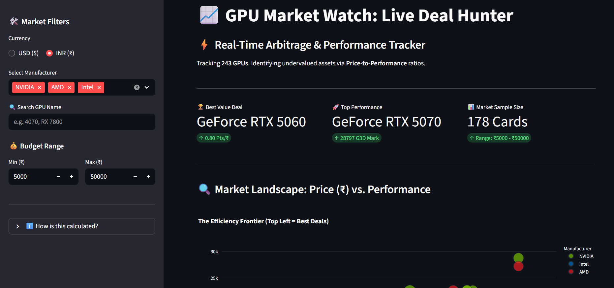
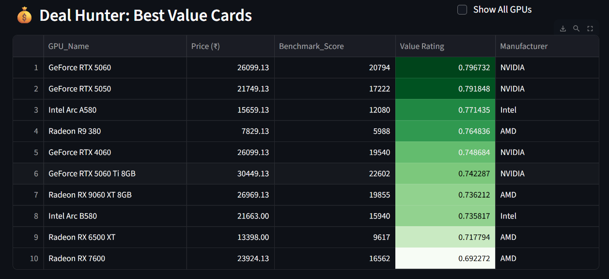

# 🚀 GPU Market Watch

[](https://gpu-market-watch-pxogjqtjs6ij8kf8kjihze.streamlit.app)
[](https://github.com/Mohammad-Faiz-Ullah/gpu-market-watch/actions/workflows/daily_scraper.yml)

A fully automated data pipeline that tracks GPU prices daily to find the best "Price-to-Performance" value cards.

## 📊 How It Works
This project uses an **ETL (Extract, Transform, Load)** architecture to run completely autonomously:

1.  **Extract:** A Python script scrapes real-time pricing and benchmark scores from *VideoCardBenchmark.net*.
2.  **Transform:** Data is cleaned using **Pandas**, and a "Value Rating" (Score / Price) is calculated for every GPU.
3.  **Load:** The clean data is pushed to a **Supabase (PostgreSQL)** database.
4.  **Visualize:** A **Streamlit** dashboard fetches the latest data from the DB to display the top deals.
5.  **Automate:** **GitHub Actions** runs the scraper every day at 06:00 UTC (11:30 AM IST) to keep data fresh.

## 🛠️ Tech Stack
* **Language:** Python 3.13
* **Cloud Database:** Supabase (PostgreSQL)
* **Automation:** GitHub Actions (Cron Job)
* **Frontend:** Streamlit
* **Libraries:** `pandas`, `beautifulsoup4`, `psycopg2`, `requests`

## 📂 Project Structure
```text
├── .github/workflows/   # Contains the automation config (daily_scraper.yml)
├── app.py               # The Streamlit Dashboard frontend
├── scraper.py           # The backend script (runs on GitHub Actions)
├── requirements.txt     # List of dependencies
└── README.md            # Project Documentation
```

## ✨ Key Features
* **Deal Hunter Engine:** Automatically calculates a "Value Rating" (Performance per Dollar) to highlight hidden gems.
* **Real-Time Filters:** Filter GPUs by **Manufacturer** (NVIDIA/AMD/Intel), **Price Range**, or **Search** by name.
* **Market Analytics:** Displays key metrics like the absolute *Best Value Deal* and *Top Performance* card currently available.
* **Color-Coded Heatmap:** Visualizes value ratings (Green = Good Deal, White = Average) for instant insights.

## 📸 Screenshots

### 1. Live Deal Hunter Dashboard
*Real-time arbitrage tracking with key market metrics.*


### 2. The "Best Value" Table
*Automatically ranked list of GPUs based on Price-to-Performance ratio.*


## 🔧 Local Installation & Setup
Want to run this project locally? Follow these steps:

**1. Clone the repository**
```bash
git clone [https://github.com/Mohammad-Faiz-Ullah/gpu-market-watch.git](https://github.com/Mohammad-Faiz-Ullah/gpu-market-watch.git)
cd gpu-market-watch
```
**2. Install Dependencies**
```bash
pip install -r requirements.txt
```

**3. Configure Secrets** 
*Create a .env file (for the scraper) and a .streamlit/secrets.toml file (for the dashboard) with your Supabase credentials:

Inside .env:
